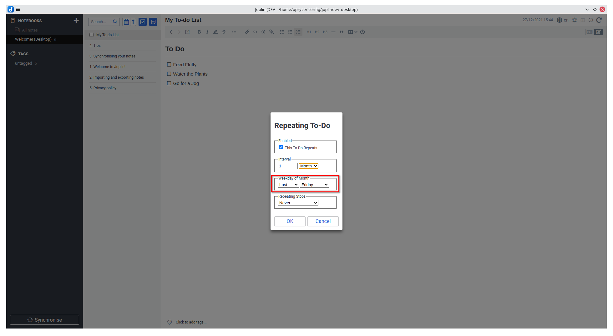

# Jolpin Repeating To-Dos

A powerful and comprehensive plugin for to-do repetition/recurrence


## Overview
This plugin allows to-do's in joplin to be repeated based on the to-do alarm date. When a to-do is checked as complete, the todo alarm date is immediately reset to the next recurrence date, and the to-do is unmarked as completed.

This plugin allows to-dos to be repeated every minute, hour, day, week, month and year, based on the to-do alarm date and time. Weekly to-dos can also recur on specific weekdays (eg Mon-Fri or Sun, Sat and Wendesday, etc.) and monthly to-dos can recur on specific weekdays of the month (eg, the first Sunday, the second Friday, the last Tuesday, etc)

The plugin also stops to-dos from being repeated after a certain number of repetitions or after a specific date.


## Installation
This plugin is in the joplin plugin repository and can be installed from within the application. Simply start joplin, go to the Settings/Options page, go to the Plugins section, and in the search bar, type in "Repeating To-Dos" then click install. The plugin should be enabled after joplin restarts

## Usage

### Recurrence Dialog
1. On any note page, in the note toolbar, a recurrence icon will be shown. Click this button to open the recurrence settings for that to-do


2. The recurrence dialog will appear. The first checkbox determines if the to-do should repeat or not. This checkbox must be checked for this to-do to repeat. Once the checkbox is checked, further options will show


3. The interval box determines how often the to-do should repeat (eg, every 2 days, every week, every 4 months, etc.).

The interval box specifies which time interval between each to-do repetition. The valid options are minutes, hours, days, weeks, months and years.


The interval number box determines the number of time intervals before a to-do repeats. For example, if the interval is set to hours, entering 1 in this box means the task repeats every hour. Setting 2 in the box means the task repeats every 2 hours. Setting 5 in the box means the task repeats every 5 hours (and so on...)


4. If the recurrence interval is set to weeks, the Weekdays box will allow you to select which specific weekday the to-do should repeat on. For example, checking Mondays, Wednesdays and Fridays, means the task will only repeat on those specific days. Setting no weekdays means the to-do will repeat only on the same weekday the original alarm date fell on.


5. If the recurrence interval is set to month, the Weekday of Month box will allow you to select which specific weekday of the month the to-do should repeat on. For example, setting it to the First Sunday, Last Wednesday, Third Friday, etc. Valid options for the weekdays of month are the first, second, third, fourth and last weekdays, which can be from Sunday to Saturday. Not setting a specific weekday of month means the to-do will repeat monthly on the same date that the original alarm date fell on



6. To-dos can be set to repeat forever (default),


or to stop repeating after a certain number of times,


or after a specific date


7. Once the to-do has been configured to specifications, click OK to save the changes.

### Database Updates

The Repeating To-Do plugin maintains a database of each note's repetition settings. Occasionally, this database becomes out of sync with the actual notes and to-dos in joplin. In order to update the database and resynchronise it, just go to the Tools menu then select "Repeating To-dos" -> "Update recurrence database".

## Installation (Development) If you wish to contribute to this plugin, you're
more than welcome to! To start, create a fork of this repository at
https://github.com/BeatLink/Joplin-Repeating-Todos-Plugin.

Next, clone this repository to your workstation using git. (the below should be changed to point to your own fork)

```bash
git clone git@github.com:BeatLink/Joplin-Repeating-Todos-Plugin.git
```

Afterwards, open a terminal in the repository root, and run the following to install dependencies.

```bash
npm install
```

You can then make changes to your code as needed. A good IDE tool to use is VS Code (or alternatively VSCodium, which is a more private version of VSCode)

To build your changes, run

```bash
npm run dist
```

The compiled code will be saved to the `/dist` folder. The joplin plugin will be built in the `/publish` folder

Debugging can also be aided by launching joplin in development mode to be used as a testing ground.

```bash
/path/to/joplin --env dev
```

The repeating to-do plugin will need to be added as a development plugin.

Once you have made your changes, commit, and push your changes to your fork and
create a pull request on Github.
